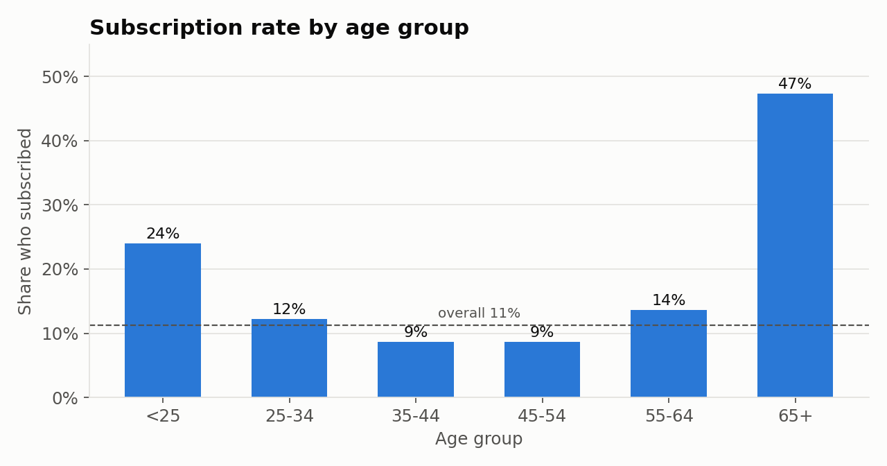
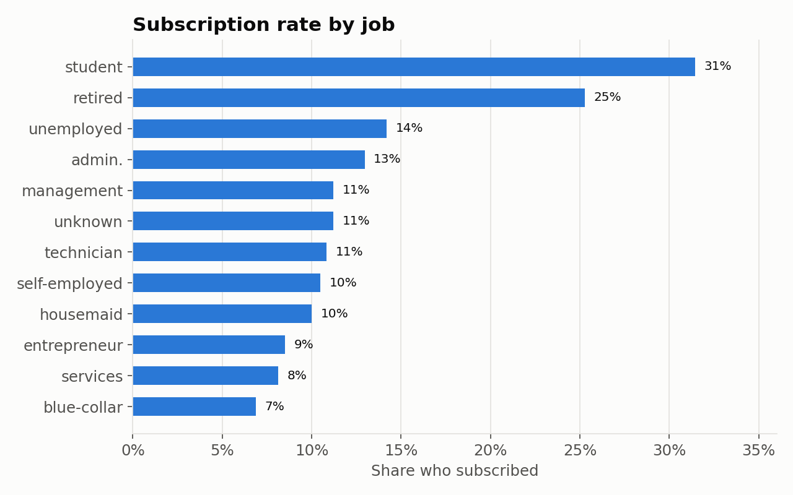
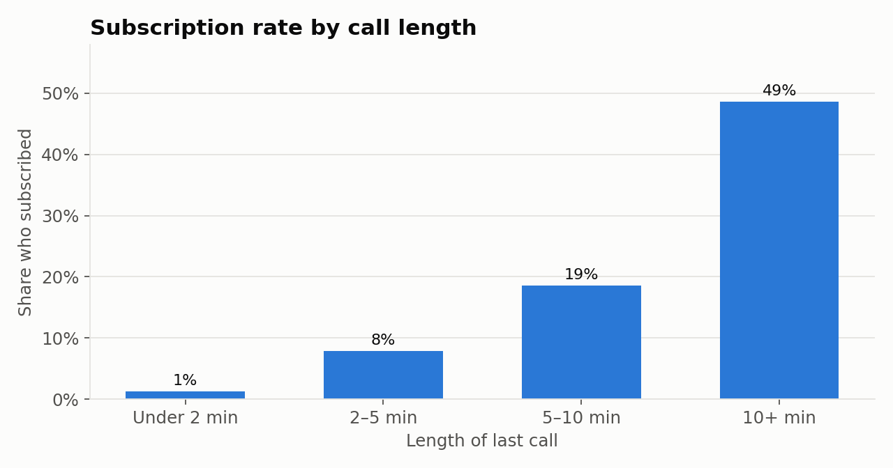

# Bank Marketing Campaign Analysis

A Portuguese bank ran phone campaigns to get customers to open a term deposit. I wanted to find out who actually said yes and what those calls had in common, so the bank could spend its calling time on the right people. I cleaned the data in Excel and built the charts in Tableau.

**Tools:** Excel, Tableau

**Data:** 41,176 customer contacts with 21 fields each ([UCI Bank Marketing dataset](https://archive.ics.uci.edu/dataset/222/bank+marketing), Moro, Rita & Cortez, 2014)

## What I did

1. **Cleaned the data in Excel.** I renamed the short column names to clear ones (for example `y` became `subscribed`, `duration` became `call_duration_seconds`, and `poutcome` became `previous_campaign_outcome`) and turned the sheet into an Excel table. The final file has no duplicate rows and no blank cells.
2. **Kept the "unknown" values.** Six columns use "unknown" instead of a real answer. The credit default column alone has about 8,600 of them, so dropping those rows would have thrown away about a fifth of the data. I left "unknown" as its own category instead.
3. **Added an age group column** (under 25, 25-34, 35-44, 45-54, 55-64, 65+) so age could be compared in ranges instead of single years.
4. **Built the analysis in Tableau.** I made a `Subscription Rate` calculated field (1 if the customer subscribed, 0 if not) and averaged it across age group, job, and call length.

## What I found

- **Most calls didn't work.** Only about 11% of customers subscribed (4,639 out of 41,176).
- **The oldest and youngest customers said yes the most.** 47% of customers 65 and older subscribed, and 24% of customers under 25. Customers between 35 and 54 were the lowest at about 9%.
- **Job lined up with age.** Students (31%) and retirees (25%) had the highest rates. Blue-collar workers had the lowest at 7%.
- **Longer calls went with more sign-ups.** Calls under 2 minutes almost never ended in a sale (1%). Calls over 10 minutes did about half the time (49%).
- **Past customers came back.** People who said yes to an earlier campaign said yes again 65% of the time.
- **Cell phones beat landlines,** 15% compared to 5%.

One thing to keep in mind about call length: nobody knows how long a call will last until it's over, so it can't be used to pick who to call. It's more useful for training the callers than for building the call list.

## What I'd recommend

- Move more of the call list toward retirees, students, and anyone who said yes to a past campaign.
- Call cell numbers first.
- Train callers to keep interested customers on the line instead of rushing to close. The data shows the short calls are almost always a no.

## Charts

*These preview charts were made from the project data so they show up on GitHub. The original Tableau views are in the workbook.*

## Files

| File | What it is |
|---|---|
| `data/bank-additional-full.xlsx` | Starting data |
| `excel/Bank Marketing Analysis Project.xlsx` | Cleaned data as an Excel table |
| `tableau/Bank Marketing Campaign Analysis.twb` | Tableau workbook (3 sheets) |
| `tableau/bank_marketing_final.csv` | Final data the Tableau workbook reads, with the age group column |

**To open the Tableau workbook:** open the `.twb` in Tableau Desktop or Tableau Public. If Tableau asks where the data is, point it to `bank_marketing_final.csv` in the same folder.

## Data source

Moro, S., Rita, P., & Cortez, P. (2014). *Bank Marketing* [Dataset]. UCI Machine Learning Repository. https://doi.org/10.24432/C5K306 (CC BY 4.0)
